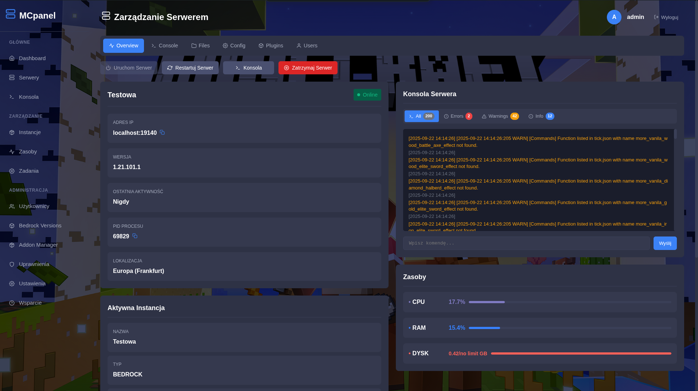

# 🎮 Minecraft Server Panel (MCPanel)


<p align="center">
  
</p>

Professional web-based control panel for managing Minecraft servers (Java and Bedrock Edition) with Docker support.

## ✨ Features

### 🎮 Server Management
- **Multi-Server Management** - Manage multiple Minecraft servers simultaneously
- **One-Click Operations** - Start, stop, restart servers with single click
- **Real-time Status** - Live server status and performance monitoring

### ⚡ Real-time Monitoring
- **Live Console** - Real-time server console with command execution
- **Performance Dashboard** - CPU, memory, and disk usage monitoring
- **Player Tracking** - Real-time player count and activity monitoring

### 🔧 Advanced Controls
- **Plugin/Addon Management** - Install and manage plugins/addons
- **File Manager** - Built-in file browser and editor
- **Backup System** - Automated server backups and restoration
- **User Permissions** - Granular permission system for multiple users

### 🐳 Docker Ready
- **Easy Deployment** - Quick setup with Docker Compose
- **Port Management** - Automatic port allocation and forwarding
- **Volume Persistence** - Data persistence across container restarts

## 🚀 Quick Start

### Prerequisites

- 🐳 **Docker** and **Docker Compose** installed
- 💾 **At least 2GB RAM** available
- 🐧 **Linux host** recommended for best performance

### Installation

1. **Clone the repository:**
```bash
git clone https://github.com/gekomod/mcpanel.git
cd mcpanel
```

2. Access the panel:

🌐 Web Interface: http://your-server-ip:3000

🔧 API Server: http://your-server-ip:5000

### Docker Hub Image
You can also use the pre-built image from Docker Hub:

```bash
docker pull gekomod/mcpanel:latest
```

### 📊 Screenshots
<div align="center">
	
	

	
	

	


</div>

### 🌐 Supported Server Types
Minecraft Java Edition

✅ All versions supported

✅ Automatic JAR downloading

✅ Plugin support (Bukkit/Spigot/Paper)

✅ Mod support


Minecraft Bedrock Edition

✅ Windows/Linux servers

✅ Addon management

✅ Behavior packs & Resource packs

✅ World management

### 🔧 Configuration

Port Configuration

The panel uses the following ports:


Port	Protocol	Purpose	Status

3000	TCP	Web Interface (Frontend)	🔵 Required

5000	TCP	API Server (Backend)	🔵 Required

19132	UDP	Minecraft Bedrock Edition	🟢 Optional

19133	UDP	Minecraft Bedrock Edition	🟢 Optional

25565	TCP	Minecraft Java Edition	🟢 Optional

25566	TCP	Additional Java Server	🟢 Optional

25567	TCP	Additional Java Server	🟢 Optional

### 🔒 Security Features

JWT Authentication - Secure user authentication

Role-based Permissions - Granular access control

API Rate Limiting - Protection against abuse

Input Validation - SQL injection prevention

CORS Configuration - Cross-origin security

### 📄 License

Copyright Notice

© 2025 Minecraft Server Panel (MCPanel). All rights reserved.
